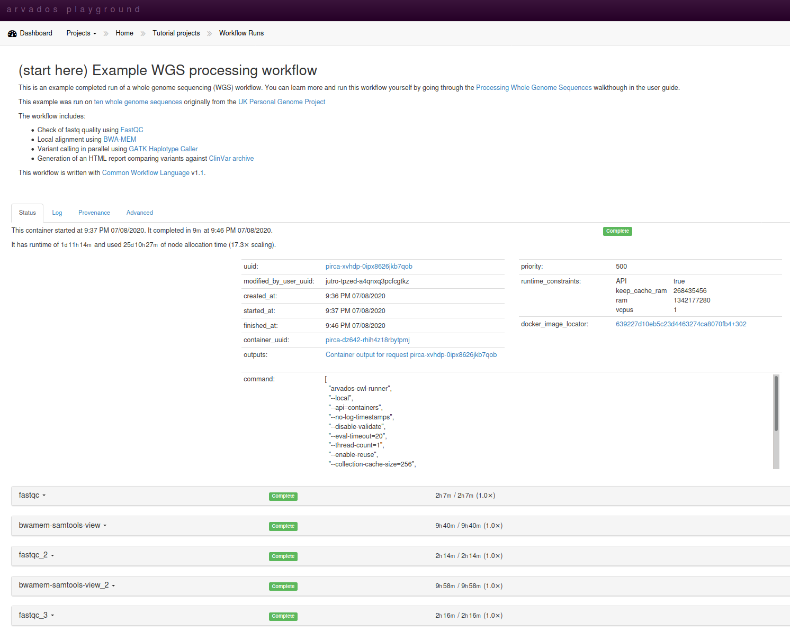

_Last updated 2020-11-25 for [Arvados 2.1](https://doc.arvados.org/v2.1/)._


✅ - Support  
❌ - No support  
⚠ - Complicated  

| Documentation | How-Tos | Install guides | GUI | CLI | API | Demo | Local | Cluster | Cloud | Ease of setup | Easy of use | CWL version |
| -- | --- | -- | -- | -- | -- | -- | -- | -- | -- | -- | -- |
| ✅ | ✅ | ✅ | ✅ | ✅ | ✅ | ✅ | ⚠ | ✅ | ⚠ | ⚠ | ✅ | v1.2 |


# Arvados

[Arvados](https://arvados.org/) is a server-based workflow engine that can also manage workflows, containers and data for multiple users.

The server can be communicated with programmatically using [Arvados REST API](https://doc.arvados.org/api/), wrapped by [language bindings](https://doc.arvados.org/v2.1/sdk/) for Python, Go, R, Ruby, Java and Perl. 

The [command line tool `arv`](https://doc.arvados.org/v2.1/sdk/cli/install.html) can be used for communicating with the Arvados server, and the [arvados-cwl-runner](https://doc.arvados.org/v2.1/user/cwl/cwl-run-options.html) provides a `cwl-runner` compliant command line for executing CWL workflows in one go.

The Arvados server also provide a Web interface, the [Arvados Workbench](https://doc.arvados.org/v2.0/user/getting_started/workbench.html).

Arvados' maker Curii is one of the major contributors to the [Common Workflow Language](https://www.commonwl.org/) standards, and Arvados 2.1 supports the latest [CWL specification 1.2](https://www.commonwl.org/v1.2/).


## Features

Arvados is perhaps the most feature-rich workflow engine for executing CWL, with multiple 

## GUI

* **GUI?** Yes

The [Arvados Workbench](https://doc.arvados.org/v2.1/user/getting_started/workbench.html) provides a Web-based
interface to running workflows on Arvados.

It is also possible to create/modify CWL workflows in a graphical editor using the [Arvados Composer](https://doc.arvados.org/v2.1/user/composer/composer.html), which is based on the standalone [Rabix Composer](http://docs.rabix.io/rabix-composer-home).



However it is more common to edit CWL workflows locally and interact with Arvados server using the command line tool.

## CLI

* **CLI?** Yes

The [arv](https://doc.arvados.org/v2.1/sdk/cli/index.html) command line tool provides shell access to interact with a remote Arvados server, to upload CWL workflows and its container images, to run workflows and to stage/unstage their inputs and outputs.

The [arvados-cwl-runner](https://doc.arvados.org/v2.1/user/cwl/cwl-run-options.html) provides a `cwl-runner` interface compatible with `cwltool`, allowing remote workflow execution as if it was local.

## API

* **API?** Yes

All features of Arvados can be accessed through the [Arvados REST API](https://doc.arvados.org/api/), which is also wrapped by [language bindings](https://doc.arvados.org/v2.1/sdk/) for Python, Go, R, Ruby, Java and Perl. 

## Demo

* **Demo?** Yes

Arvados can be tried in the [Arvados Playground](https://playground.arvados.org/) or installed locally for evaluation purposes using [Arvados-in-a-box](https://doc.arvados.org/install/arvbox.html).

The playground includes a pre-computed run of the tutorial [Processing Whole Genome Sequences](https://doc.arvados.org/v2.1/user/tutorials/wgs-tutorial.html) which can be followed step-by-step to get to know the Arvados Workbench.


## Installation options

As a client/server architecture Arvados can be complex to install. The [multiple installation options](https://doc.arvados.org/v2.1/install/index.html) of Arvados have varying degree of setup difficulty, features and customization options.

Hosted cloud installs and subscriptions of Arvados are provided by its main developer [Curii](https://www.curii.com/), including the free [Arvados Playground](https://playground.arvados.org/) which can be tried for evaluation purposes before installing Arvados.


### Local install

Arvados supports two main ways to install the server on a local machine.

* Arvados-in-a-box
* Single host install

For pure ease of install, Arvados-in-a-box would be the recommended way forward for a test and development environment, with progression to the single-host install for a production environment.

#### Arvados-in-a-box

[Arvados-in-a-box](https://doc.arvados.org/v2.1/install/arvbox.html) is a [Docker](https://www.docker.com/)-based distribution. This uses a Docker container to run an instance of Arvados on a single machine.  This requires that the user have `root` privilages and Docker installed, but is relatively straight forward to run using a dedicated `arvbox` command line tool:

```bash
$ git clone https://github.com/arvados/arvados.git
$ cd arvados/tools/arvbox/bin
$ ./arvbox start localdemo
$ ./arvbox adduser demouser demo@example.com
```

```warning
Note that many CWL workflow use [DockerRequirement](https://www.commonwl.org/user_guide/07-containers/index.html), but running Docker-in-Docker requires `-privileged` mode (effectively giving Arvados root access) or experimental [rootless Docker in Docker](https://docs.docker.com/engine/security/rootless/#rootless-docker-in-docker).
```

```info
Arvados-in-a-box approach is intended for **demonstration/testing purposes** and is not intended for production use.
```

#### Single host Arvados

The [Single host](https://doc.arvados.org/v2.1/install/salt-single-host.html) install of Arvados uses [Saltstack](https://www.saltstack.com/) to install and configure Arvados as [individual components](https://doc.arvados.org/v2.0/architecture/index.html) on the server, as such this requires and installation and knowledge of Salt.  

For the purposes of testing locally this is perhaps better suited to those who plan to use the cluster install of Arvados (using Saltstack) later.  There is also the option to do a complete _manual install_ of Arvados although they themselves note that this is complex.


## Cluster/Cloud install

Arvados can be configured for use on a cluster in 3 main ways:

* Using **Saltstack** to setup and configure a cluster
* Setting up Arvados to wrok with a **Kubernetes** cluster
* **Manual** installation of Arvados and the cluster.

### Salt/Vagrant

Arvados can be installed in a virtual machines using a combination of [Vagrant](https://www.vagrantup.com/) (for building the virtual machine) and [SaltStack](https://docs.saltstack.com/en/latest/) (for software install and configuration management).

Following the instructions for [Salt](https://doc.arvados.org/v2.1/install/salt.html) you can choose to install using one of three options:

* [Use Vagrant to install Arvados in a virtual machine](https://doc.arvados.org/v2.1/install/salt-vagrant.html)
* [Arvados on a single host](https://doc.arvados.org/v2.1/install/salt-single-host.html)
* [Arvados across multiple hosts](https://doc.arvados.org/v2.1/install/salt-multi-host.html)

### Kubernetes

Arvados [install on Kubernetes](https://doc.arvados.org/v2.1/install/arvados-on-kubernetes.html) is documented for [Minikube](https://doc.arvados.org/v2.1/install/arvados-on-kubernetes-minikube.html) and [Google Kubernetes Engine](https://doc.arvados.org/v2.1/install/arvados-on-kubernetes-GKE.html), both using [Helm](https://helm.sh/).


### Manual install

Installing Arvados manually on a Linux server is the most time-consuming option, but allows you to pick-and-choose Arvados Components and rely more on the distribution's own software, for instance Postgres database.

The [prerequisites](https://doc.arvados.org/v2.1/install/install-manual-prerequisites.html) lists all required software, after which [package repositories](https://doc.arvados.org/v2.1/install/packages.html) for Centos 7 or Debian/Ubuntu add the Arvados modules.

Supported distributions as of Arvados 2.1:

* Centos 7 (by implication also _RHEL 7_)
* Debian 10 _buster_
* Debian 9 _stretch_
* Ubuntu 18.04 _bionic_
* Ubuntu 16.04 _xenial_

## Cloud storage

It is possible to configure Arvados' [Keepstore](https://doc.arvados.org/v2.1/install/install-keepstore.html)
storage module to save data on [file system](https://doc.arvados.org/v2.1/install/configure-fs-storage.html), 
[S3](https://doc.arvados.org/v2.1/install/configure-s3-object-storage.html) or [Azure blob](https://doc.arvados.org/v2.1/install/configure-azure-blob-storage.html)s.

The working directories of Arvados for storing workflow definitions are also accessible as `git` repositories.

## Compute nodes

While it is possible to execute workflows locally on the Arvados head node, it is recommended to configure _compute nodes_ that can execute the individual tools from the steps of the CWL workflow. These tools are run from [Docker containers](https://www.docker.com/).

### Cloud: AWS/Azure

Arvados has helpers to build [compute node images](https://doc.arvados.org/v2.1/install/crunch2-cloud/install-compute-node.html) for Azure and Amazon AWS.

Connecting Arvados to worker nodes on the cloud require [extensive configuration](https://doc.arvados.org/v2.1/install/crunch2-cloud/install-dispatch-cloud.html)


### Cluster: Slurm

Clusters using the [Slurm workload manager](https://slurm.schedmd.com/) can be [used as compute nodes](https://doc.arvados.org/v2.1/install/crunch2-slurm/install-compute-node.html) by Arvados.

The compute nodes in the cluster must be [prepared for Arvados](https://doc.arvados.org/v2.1/install/crunch2-slurm/install-compute-node.html), e.g. installing Docker.


## Documentation

Extensive documentation for Arvados is available on <https://doc.arvados.org/>, including:

* [Arvados User Guide](https://doc.arvados.org/v2.1/user/)
* [Arvados installation](https://doc.arvados.org/v2.1/install/)
* [Arvados SDKs](https://doc.arvados.org/v2.1/sdk/)
* [Arvados CLI](https://doc.arvados.org/v2.1/sdk/cli/)
* [Arvados API](https://doc.arvados.org/v2.1/api/)
* [Arvados Admin](https://doc.arvados.org/v2.1/admin/)
* [Arvados Architecture](https://doc.arvados.org/v2.1/architecture/)

The tutorial [Processing Whole Genome Sequences](https://doc.arvados.org/v2.1/user/tutorials/wgs-tutorial.html) explores step-by-step the setup and execution of a real-life bioinformatics pipeline using the Arvados Workbench GUI and the `arv` command line tool.


## Support options: Community/Enterprise

The [Arvados Community](https://arvados.org/community/) provides support and collaboration for the open source edition of Arvados. Enterprise support is available from [Curii](https://www.curii.com/).

## Pros/cons

Arvados can be a good choice in these situations:

* Multiple users of single compute architecture
* Productionizing a relatively fixed workflow
* API integration is desired (e.g. to build custom Web Apps)
* Long-running workflow service

Arvados can be difficult in these situations:

* Workflows change often (as they need to be uploaded to Arvados)
* Tools change often (as container images need to be pre-loaded)
* Single user (too heavyweight for install on a laptop)
* Training situations (although Arvados-in-a-Box can be easily launched)